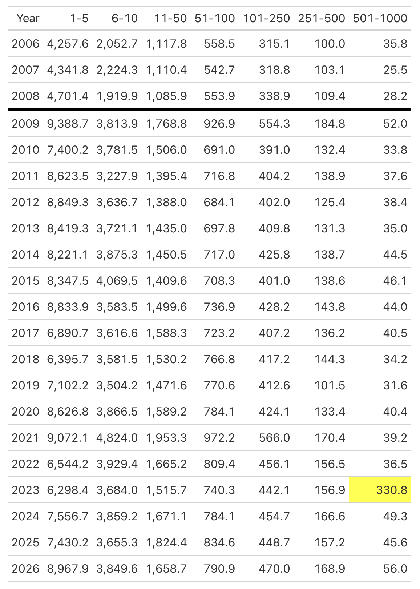
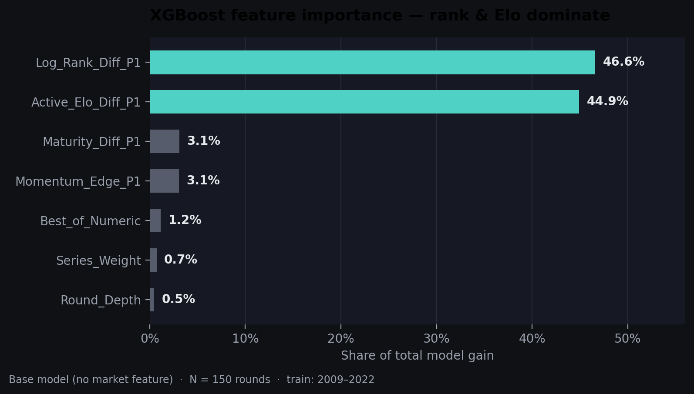
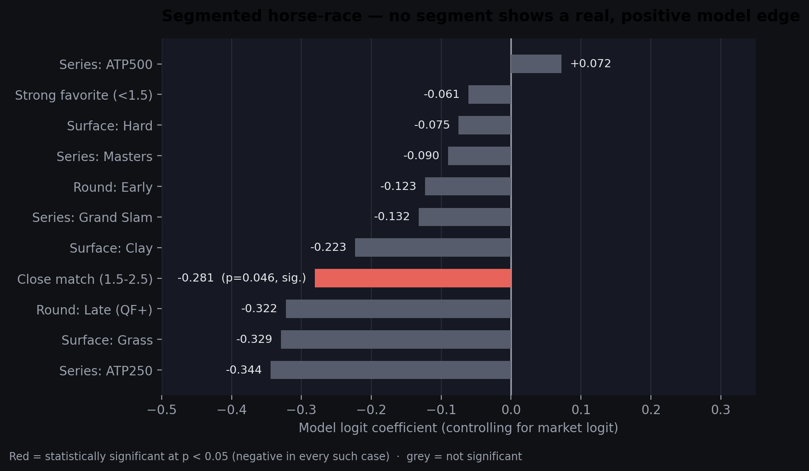
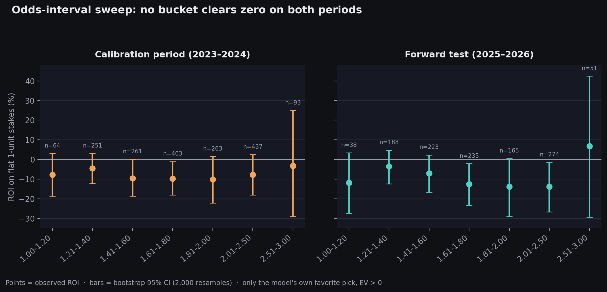
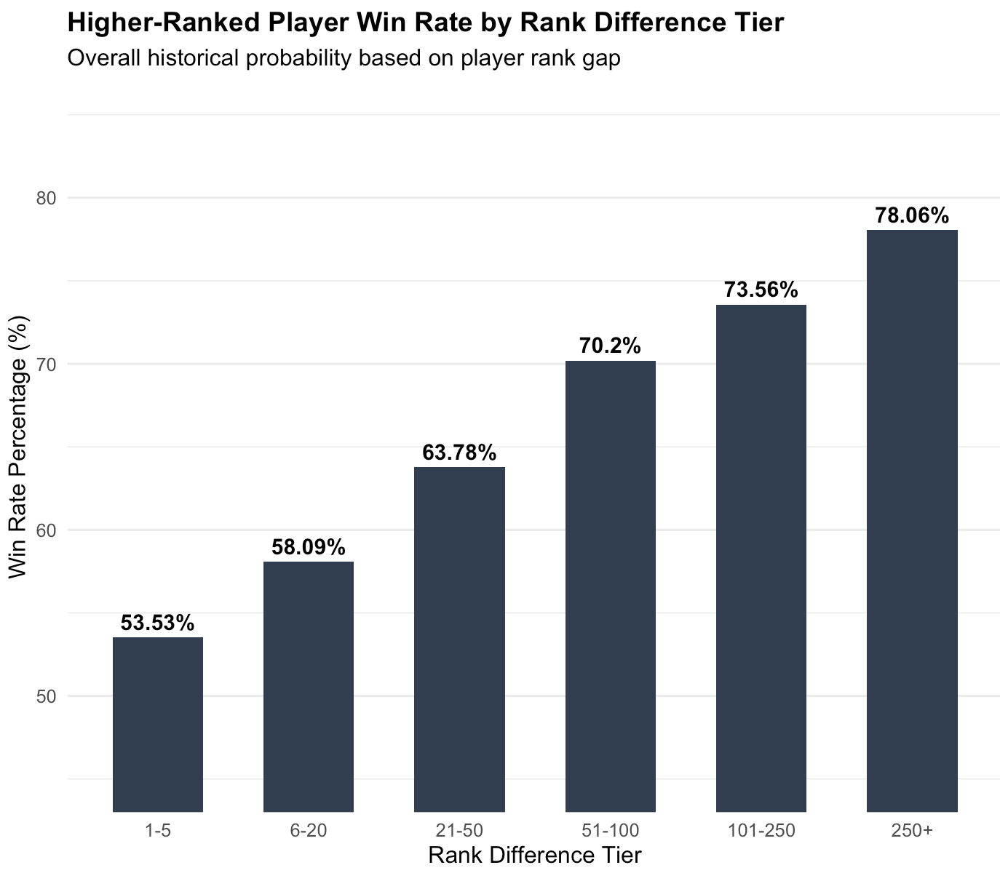
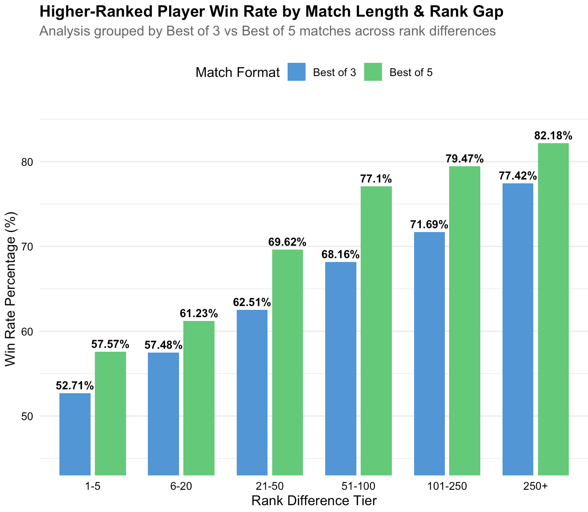
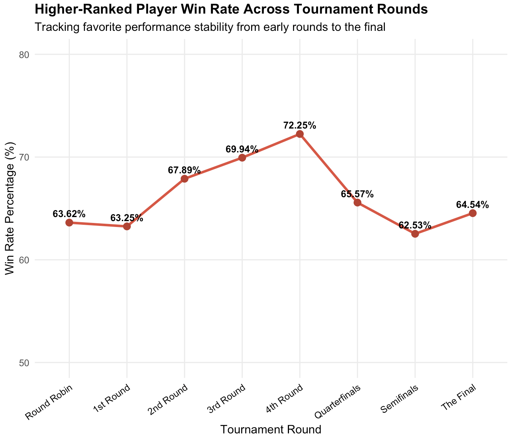

# Can a Tennis Prediction Model Beat the Bookmakers?

**A full ML pipeline — from messy raw ATP data to a calibrated, validated
win-probability model — built to answer one specific question:** once you
control for what the bookmaker's own odds already say, does a model built
from public match data add any real predictive value?

The answer, backed by four independent statistical tests, is **no** — and
that null result, reached through a deliberate, rigorous attempt to disprove
my own promising-looking backtest rather than assumed, is the actual point of
this project.

https://mustafak50.github.io/atp-tennis-model-validation/

---

## Results at a glance

| | |
|---|---|
| **Data** | ~65,900 ATP men's tour matches, 2000–2026 (results, rankings, points, odds) |
| **Model** | XGBoost, chronologically trained (2009–2022) → calibrated (2023–2024) → forward-tested once (2025–2026) |
| **Forward-test accuracy** | 65.6% (model) vs. **68.5%** (market odds alone) |
| **Forward-test AUC** | 0.717 (model) vs. **0.752** (market odds alone) |
| **Headline finding** | Model's residual signal over the market is **not statistically significant** in the aggregate, in any of 11 tested sub-segments, or after adding the market price as a feature |
| **Betting-strategy sweep** | 0 of 7 odds buckets show a bootstrap 95% CI that clears zero on *both* the calibration and forward-test periods |

This is a **negative result, reached honestly** — the project is a demonstration
of data cleaning, leakage-safe feature engineering, and rigorous out-of-sample
validation methodology, not a profitable betting system.

---

## Why this project

Sports betting markets are a useful, low-stakes sandbox for a question that
comes up constantly in applied data science: *"my backtest looks profitable —
is that a real edge, or did I just get lucky on this sample?"* Betting markets
are ideal for practicing this because there's a built-in, hard-to-argue-with
baseline (the bookmaker's implied probability) and a clear, falsifiable claim
("my model beats that baseline").

This repo documents the full journey: data cleaning, feature engineering,
model training, calibration, and — the part most portfolio projects skip — a
genuine attempt to disprove my own promising-looking results before trusting
them.

---

## Data

ATP men's tour match-level data (2000–2026) including match results, scores,
player rankings, ranking points, tournament metadata, and bookmaker odds.

**Before touching any modeling**, I audited the raw data and found (and
fixed) several real issues:

- **~3,800 rows** with sentinel/placeholder odds values requiring careful
  handling (distinguishing genuinely missing data from legitimate
  extreme-favorite prices)
- **6 rows** where odds had been entered on the wrong scale (fractional
  instead of decimal) and needed inverting
- **~1,785 raw player name strings** collapsing to **~1,652 real players**
  after normalization (initials, hyphenation, diacritics, and known typos)
- **A statistical impossibility caught via a sanity check**, not a
  null-value scan: average ranking points for the 501–1000 rank tier in 2023
  came out *higher* than the 251–500 tier — mathematically impossible given
  how ATP points are structured.

  | Year | 1–5 | 6–10 | 11–50 | 51–100 | 101–250 | 251–500 | 501–1000 |
  |---|---|---|---|---|---|---|---|
  | 2022 | 6,544.2 | 3,929.4 | 1,665.2 | 809.4 | 456.1 | 156.5 | 36.5 |
  | **2023** | 6,298.4 | 3,684.0 | 1,515.7 | 740.3 | 442.1 | 156.9 | **330.8** |
  | 2024 | 7,556.7 | 3,859.2 | 1,671.1 | 784.1 | 454.7 | 166.6 | 49.3 |

  

  The 501–1000 average of 330.8 in 2023 (vs. 49.3 the following year and
  ~36–50 in every surrounding year) doesn't fit any real trend — it's a
  step-change in a single year, isolated to a single tier. Filtering matches
  down to that year/tier combination traced the error to two tournaments
  (Lyon Open, Geneva Open) with corrupted rank/points fields, which were
  corrected manually against official ATP records.

- **1,632 Carpet-surface matches** dropped (discontinued on tour after 2008,
  not representative of current conditions)

This kind of check — comparing an aggregate against what's structurally
possible, not just scanning for `NA`s — is what caught an error that would
otherwise have silently fed bad rank/points signal into the Elo and ranking
features below.

---

## Feature engineering

- **Sequential, surface-specific Elo ratings** (Hard / Clay / Grass tracked
  independently), updated match-by-match in strict chronological order with
  no lookahead, and an adaptive K-factor that lets new/returning players'
  ratings converge faster in their first 10 matches on a surface.
- **Log-rank differential** between opponents.
- **Career maturity differential** (total matches played, as a proxy for
  experience gap).
- **First-set "momentum" features**: a player's trailing (lagged) rate of
  winning the first set, and their trailing recovery rate after losing it —
  combined into a directional momentum-edge feature.
- **Tournament context**: ordinal weights for tournament tier (Slam /
  Masters / ATP500 / ATP250) and round depth.
- Head-to-head features (raw and surface-specific) were also engineered and
  tested, but consistently failed to improve out-of-sample performance, so
  they were dropped from the final feature set — a negative result worth
  keeping visible rather than silently discarding.

Every one of these is computed as a **trailing / lagged** statistic —
nothing in a given row is allowed to see that match's own outcome. This is
what makes the later validation trustworthy rather than an artifact of
leakage.

---

## Modeling approach

- **Chronological three-way split** (never random, since this is a time
  series with dependent observations): train on 2009–2022, calibrate on
  2023–2024, forward-test on 2025–2026. The forward-test period is touched
  only once, at the very end.
- **XGBoost** (`binary:logistic`, shallow trees, moderate regularization)
  trained only on public match-context features — bookmaker odds are
  deliberately excluded from training and used solely as an evaluation
  benchmark.
- **Platt scaling** (logistic recalibration) fit on the held-out calibration
  period, to correct the model's raw probabilities before they're ever
  applied to the forward-test period.
- Evaluated throughout with **proper scoring rules** — log loss, Brier
  score, AUC, and Expected Calibration Error — not just accuracy, which can
  look reasonable even for a poorly calibrated model.

### Model performance (2025–2026 forward test, N = 3,378)

| Metric | Market Odds Alone | Model (Calibrated) |
|---|---|---|
| Accuracy | 68.5% | 65.6% |
| Log Loss | 0.587 | 0.614 |
| Brier | 0.202 | 0.214 |
| AUC | 0.752 | 0.717 |
| ECE | 0.016 | 0.013 |

The model is well-calibrated (its predicted probabilities match observed
frequencies closely across the full range, including the tails — verified
via a 10-bin reliability check), but it's **less accurate than simply using
the bookmaker's own implied probability.** That gap alone doesn't rule out a
narrow, valuable disagreement in specific situations — which is exactly what
the four tests below were built to check.

### Feature importance

`xgb.importance()` on the final model, trained without any market feature:

| Feature | Gain | Cover | Frequency |
|---|---|---|---|
| Log_Rank_Diff_P1 | 0.4658 | 0.3315 | 0.2238 |
| Active_Elo_Diff_P1 | 0.4491 | 0.3531 | 0.2844 |
| Maturity_Diff_P1 | 0.0309 | 0.1445 | 0.1917 |
| Momentum_Edge_P1 | 0.0306 | 0.1040 | 0.1429 |
| Best_of_Numeric | 0.0117 | 0.0350 | 0.0633 |
| Series_Weight | 0.0072 | 0.0204 | 0.0529 |
| Round_Depth | 0.0047 | 0.0114 | 0.0411 |



Log-rank differential and surface-specific Elo together account for **over
91% of total model gain**. That's an intuitive result on its own, but it's
also a preview of the main finding below: both features are, in essence,
reconstructions of information — recent form and results — that the
bookmaker already prices into the odds.

---

## The key question: does the model know anything the market doesn't?

Rather than trusting a single backtest, this was tested four independent
ways.

### 1. Horse-race regression

Regress the match outcome on **both** the market's implied logit and the
model's calibrated logit simultaneously. A model with genuine incremental
value would show a positive, statistically significant coefficient on its
own logit even after the market's price is accounted for.

| Term | Estimate | Std. Error | z value | p-value |
|---|---|---|---|---|
| Intercept | 0.008 | 0.038 | 0.221 | 0.825 |
| Market Logit | **1.178** | 0.091 | 12.97 | **< 0.001 \*\*\*** |
| Model Logit | −0.132 | 0.090 | −1.47 | 0.141 (not significant) |

The market's price is highly predictive on its own; the model's residual
signal is statistically indistinguishable from zero, and its point estimate
is negative.

### 2. Segmented horse-race

The aggregate result could still hide a real edge in a specific slice of
matches. The same regression was repeated within surface, tournament tier,
round, and odds-regime subsets:

| Segment | N | Model Coef. | p-value |
|---|---|---|---|
| Surface: Hard | 2,088 | −0.075 | 0.503 |
| Surface: Clay | 1,003 | −0.223 | 0.202 |
| Surface: Grass | 287 | −0.329 | 0.324 |
| Series: Grand Slam | 599 | −0.132 | 0.482 |
| Series: Masters | 972 | −0.090 | 0.578 |
| Series: ATP500 | 732 | 0.072 | 0.728 |
| Series: ATP250 | 1,060 | −0.344 | 0.053 |
| Round: Early | 2,476 | −0.123 | 0.227 |
| Round: Late (QF+) | 543 | −0.322 | 0.200 |
| Strong favorite (odds < 1.5) | 1,856 | −0.061 | 0.620 |
| Close match (both sides 1.5–2.5) | 1,360 | **−0.281** | **0.046** |



**No segment showed a positive, significant model coefficient.** One segment
— close matches, both sides priced 1.5–2.5 — showed a significant
**negative** coefficient (p = 0.046), meaning that in genuinely close
matches, following the model's disagreement with the market is actively
worse than following the market.

### 3. A market-aware model variant

A second model was trained with the market's own implied probability added
directly as an input feature, to test whether the model could learn to
correct residual market error rather than compete blind. Feature importance
showed this single feature absorbed **~80% of the model's total predictive
gain**, and a horse-race test showed its *residual* signal was still not
significant (p ≈ 0.56). In short: giving the model the market's price caused
it to mostly imitate that price rather than add anything beyond it.

### 4. Systematic odds-interval sweep

Rather than one hand-tuned combination of thresholds, every odds range from
1.00 to 3.00 was swept systematically with one fixed rule: back the model's
higher-probability side whenever it shows positive expected value.
Evaluated with bootstrap 95% confidence intervals (2,000 resamples) on both
the calibration period and the forward-test period, since with a few hundred
bets per bucket, a single positive point estimate can easily be noise.

**Calibration period (2023–2024):**

| Odds bucket | N bets | Win rate | ROI (%) | 95% CI |
|---|---|---|---|---|
| 1.00–1.20 | 64 | 79.7% | −7.69 | [−18.6, 3.14] |
| 1.21–1.40 | 251 | 71.7% | −4.49 | [−12.1, 3.06] |
| 1.41–1.60 | 261 | 60.2% | −9.54 | [−18.6, 0.15] |
| 1.61–1.80 | 403 | 52.6% | −9.70 | [−18.0, −1.07] |
| 1.81–2.00 | 263 | 46.0% | −10.2 | [−22.2, 1.58] |
| 2.01–2.50 | 437 | 41.2% | −7.79 | [−18.0, 2.56] |
| 2.51–3.00 | 93 | 35.5% | −3.27 | [−29.1, 25.0] |

**Forward test (2025–2026):**

| Odds bucket | N bets | Win rate | ROI (%) | 95% CI |
|---|---|---|---|---|
| 1.00–1.20 | 38 | 76.3% | −11.9 | [−27.4, 3.37] |
| 1.21–1.40 | 188 | 72.3% | −3.55 | [−12.4, 4.73] |
| 1.41–1.60 | 223 | 61.9% | −7.01 | [−16.6, 2.31] |
| 1.61–1.80 | 235 | 51.1% | −12.6 | [−23.4, −2.13] |
| 1.81–2.00 | 165 | 44.2% | −13.8 | [−29.0, 0.47] |
| 2.01–2.50 | 274 | 38.3% | −13.8 | [−26.7, −1.38] |
| 2.51–3.00 | 51 | 39.2% | +6.8 | [−29.4, 42.5] |



Reading this correctly means checking the **lower CI bound in every row**,
on **both** periods — a single positive point estimate with a CI spanning
deeply negative values (like the 2.51–3.00 bucket above) is not evidence of
an edge, it's the expected appearance of noise in a sample of ~50–90 bets.
**Zero of the seven buckets clear zero on both periods simultaneously** —
several are, if anything, significantly *negative*.

---

## Conclusion

Across a market benchmark, a horse-race regression, a segmented horse-race,
a market-aware model variant, and a systematic odds-interval sweep, every
test converges on the same result: **this feature set does not contain
information beyond what is already priced into the bookmaker's closing
odds.** This is a legitimate and useful finding, not a failed project — it
rules out a specific, well-motivated class of strategies through
disciplined testing, rather than either assuming an edge exists or giving up
after one promising-looking backtest.

It also points to what *would* be needed for a real edge: earlier (opening)
lines before the market has fully priced in available information,
structurally less efficient markets (lower tiers, thinner liquidity), or
genuinely new information not reflected in rank/Elo — e.g. real-time injury,
fatigue, or news signals.

---

## Supplementary analysis: how strong a signal is ranking alone?

As a sanity check on how much of "beating a market" is really achievable
from ranking data alone, I separately measured the higher-ranked player's
historical win rate directly (no model, just rank gap), across ~65,900
matches:

<p align="center">
  
  
  
</p>

Key patterns:
- Win rate for the higher-ranked player rises steadily with rank gap, from
  **53.5%** at a 1–5 rank gap to **78.1%** at a 250+ gap.
- Best-of-5 matches show a consistently higher favorite win rate than
  best-of-3 at every rank gap (e.g. 57.6% vs. 52.7% at a 1–5 gap, widening
  to 82.2% vs. 77.4% at 250+) — consistent with the intuition that a longer
  match format gives less room for upsets.
- Simply predicting "the higher-ranked player wins" gets **65.4%** overall
  accuracy and **70.2%** when restricted to matches with valid, non-extreme
  odds — a useful reference point for how much of the model's ~65.6% test
  accuracy is really coming from ranking information the market already has.

---

## Skills demonstrated

This project was built to be a representative sample of applied data-science
work, not just a modeling exercise:

- **Data auditing beyond `NA` checks** — catching a structurally impossible
  value (a rank tier's average points exceeding a higher tier's) that a
  standard missing-value scan would have missed entirely.
- **Leakage-safe feature engineering** on panel/time-series data — every
  Elo rating, form rate, and maturity count is a strictly trailing statistic
  computed in chronological order.
- **Proper model validation discipline** — chronological (not random)
  train/calibrate/test splits, a forward-test period touched exactly once,
  and evaluation using proper scoring rules (log loss, Brier, AUC, ECE)
  rather than accuracy alone.
- **Statistical rigor over a favorable point estimate** — horse-race
  regressions, segment-level robustness checks, and bootstrap confidence
  intervals used specifically to *try to break* a promising-looking result
  before reporting it.
- **Honest reporting of a negative result**, including what evidence would
  change the conclusion and what a next iteration would need to test.

---

## Repo structure

```
.
├── ModelT.R   # full pipeline: cleaning → features → model → validation
├── data/                          # (not included — see Data Source below)
├── assets/                        # supporting figures referenced in this README
│   ├── atp_points_by_rank_tier.png
│   ├── favorite_win_rate_analysis.png
│   ├── feature_importance.png
│   ├── segment_horse_race.png
│   └── odds_interval_sweep.png
└── README.md
```

## Data source

Base dataset: [ATP Tennis 2000–2023 (daily pull) on Kaggle](https://www.kaggle.com/datasets/dissfya/atp-tennis-2000-2023daily-pull/data),
extended here with matches through mid-2026. Update the path in Phase 1 of
the script (`data/atp_tennis.csv`) to point to your local copy — the raw CSV
itself isn't included in this repo due to size and licensing.


## Environment

```
Developed and tested with:
- R 4.5.3
- xgboost 3.2.1.1
- dplyr 1.2.0, tidyr 1.3.2, stringr 1.6.0, lubridate 1.9.5
- pROC 1.19.0.1
- ggplot2 4.0.2
- gt 1.3.0, data.table 1.18.4
```

## How to run

```r
source("ModelT.R")
```

Runs end-to-end: data cleaning → feature engineering → chronological
train/calibrate/test split → model training → calibration → the full
validation suite described above, printed to console.

---

## What I'd do differently / next

- **Test against opening lines rather than closing lines.** Closing odds
  have already absorbed essentially all available public information by
  definition, so any real edge is far more likely to survive against an
  opening price than a closing one.
- **Test on a structurally less efficient market** — lower tour tiers
  (Challengers, ITFs), doubles, or WTA — where bookmaker pricing attention
  and liquidity are lower.
- **Incorporate information the market prices but this dataset doesn't
  capture directly** — recent injury/withdrawal news, fatigue from recent
  match load or travel, head-to-head psychology, or surface-transition
  effects — rather than more feature engineering on the same rank/Elo
  inputs the market already reflects.
- **Model the score/margin, not just the winner.** A model that predicts
  sets or games won might carry information not reflected in a bookmaker's
  moneyline price even where the win/loss model doesn't.
- **Extend the odds-interval sweep to multiple bookmakers** to check
  whether any single book is a systematically softer line than the market
  consensus, rather than treating "the market" as one monolithic price.
- **Re-run the full validation suite on a live, rolling basis** (e.g.
  quarterly) rather than a single forward-test window, to see whether the
  null result is stable over time or whether market efficiency itself
  varies with tour conditions.
